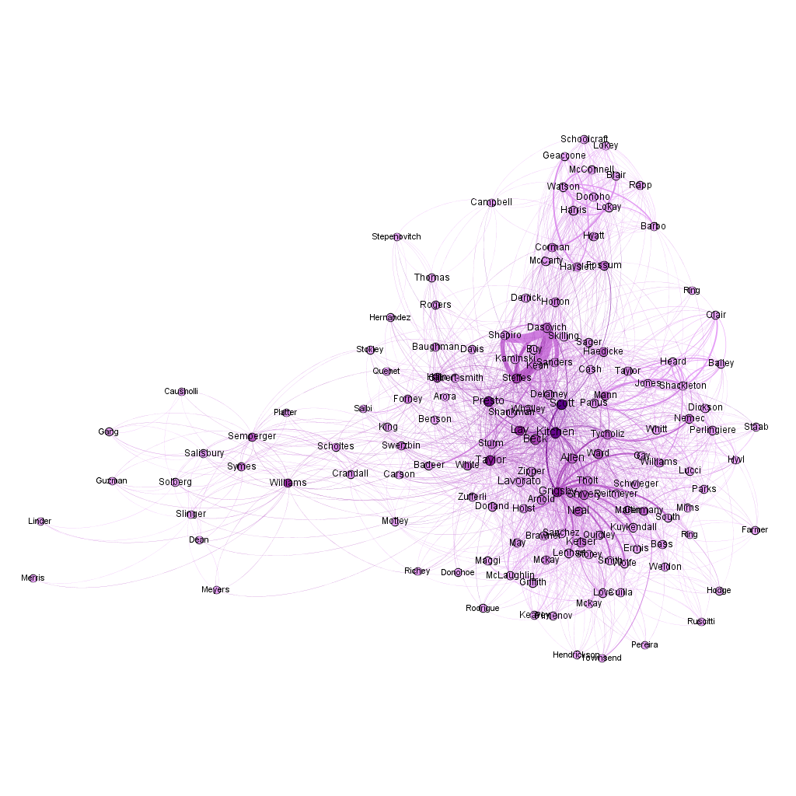

```{r setup, include=FALSE}
knitr::opts_chunk$set(echo = TRUE)
knitr::opts_knit$set(root.dir = 'T:/Documentos/R/ByAdI/Proyecto_Final')
```

```{r wrap-hook, echo=FALSE}
library(knitr)
hook_output = knit_hooks$get('output')
knit_hooks$set(output = function(x, options) {
  # this hook is used only when the linewidth option is not NULL
  if (!is.null(n <- options$linewidth)) {
    x = knitr:::split_lines(x)
    # any lines wider than n should be wrapped
    if (any(nchar(x) > n)) x = strwrap(x, width = n)
    x = paste(x, collapse = '\n')
  }
  hook_output(x, options)
})
```

## Purpouse and objetive
In this notebook I am going to collect learned knowledge in the subject "Information search and analysis" from the 3rd year of Software Engineering.  
I am going to use Enron email dataset, but I am not going to work with all the data. I am going to analyse mails from 2001 onwards. Why this date? If we search some information about Enron, we can see that on December 3, 2001 they declared their bankruptcy, so I think it is a good portion of data to analyse.

## Prepare enviroment

First of all we have to set the workspace directory where we have all the data files and images. Then, load Enron data.

```{r data, message=FALSE}
  load("enron_data_revised.rda")
```

## Explore the data and extract 
Firs of all we need to see some information of the dataset we are going to work with.


Dimensions per object
```{r}
  dim(edges)
  dim(edges.full)
  dim(nodes)
```

Lets see some sample data
```{r}
  head(edges.full)
```


Lets create communities measure for creating a igraph object and edit it with Gephi. We are going to see how the enterprise is distributed and we can understand better the context.

The next image is all enron data separated by communities (colors) and the width of nodes is calculated on the betweenness measure. This was generated with R and Gephi. 
```{r Gephi Communities, echo = FALSE, out.width = '70%', fig.cap = "Communities of Enron"}

```

### Extract data
First of all we need to format string date of the dataset to R Date object.
```{r summ, dependson=edges.full}
edges.full$rDate <- as.Date(edges.full$date)
summary(edges.full$rDate)

```

Let's extract or working dataset from 2001-01-01 until 2002-06-21
```{r subset, dependson="summ"}
edges.full.subset <- edges.full[edges.full$rDate >= as.Date("2001-01-01"),]
dim(edges.full.subset)
summary(edges.full.subset$rDate)
```

Let's extract the nodes that appear in the subset we just generated.
```{r nodessubset, dependson=edges.full.subset}
nodes.subset <- nodes[nodes$Email_id %in% edges.full.subset$sender || 
                        nodes$Email_id %in% edges.full.subset$receiver,]
```

We can see that all the nodes we had appear in the subset we are going to work with.
```{r}
dim(nodes)
```


# SNA
Now we have our subset generated, let's start doing some SNA.

I am going to create an iGraph object so we can export it to Gephi and create a network image to analyse it.

### Betweenness with iGraph and Gephi
Import necessary iGraph library
```{r igraph, message=FALSE, warning=FALSE}
library(igraph)
```


Create the iGraph object and save it
```{r igaphObject, dependson=c("igraph", "edges.full.subset")}
network.subset <- graph.data.frame(edges.full.subset[,c("sender",
                                                        "receiver",
                                                        "type",
                                                        "date",
                                                        "subject")],
                                   directed = TRUE,
                                   vertices = nodes)


write.graph(network.subset,
            file = "enron-subset.graphml",
            format = "graphml")
```

In this image we can see important people in the year of the bankruptcy: Scott, Presto, Grigslay, Taylor, Kitchen...

```{r Gephi Betweenness, echo = FALSE, out.width = '70%', fig.cap = "Betweenness centrality of Enron emails from 2001-01 to 2001-06"}

```

## SNA Metrics  
Now we are going to calculate individual SNA metrics


#### Diameter  
Is the largest distance between nodes

```{r diamater, dependson=network.subset}

diameter(network.subset)

```

#### Centrality  
We are going to compute Total degree, degree in and degree out.


```{r centrality, dependson=network.subset}

nodes.subset$degree_total <- degree(network.subset, 
                             v = V(network.subset), 
                             mode = c("total"))
nodes.subset$degree_in <- degree(network.subset, 
                             v = V(network.subset), 
                             mode = c("in"))
nodes.subset$degree_out <- degree(network.subset, 
                             v = V(network.subset), 
                             mode = c("out"))
```

Let's see the top 10 of just calculated measures.

```{r centrality_measures, dependson="centrality"}
head(nodes.subset[order(nodes.subset$degree_total,
           decreasing = TRUE),], n = 10L)

head(nodes.subset[order(nodes.subset$degree_in,
                 decreasing = TRUE),], n = 10L)

head(nodes.subset[order(nodes.subset$degree_out,
                 decreasing = TRUE),], n = 10L)

```

Dasovich is an imprtant employee because he has one of the most degrees in and out in this time period.

#### Reach 2 step  

With this measure we can see the total number of people that person can reach with that number of steps. Here we are going to see the conectivity of each person. Here we can see that the Vice president Presto has mos connections, almost with all the people of the institution.
```{r reach2, dependson=c("network.subset", "nodes.subset")}
nodes.subset$reach_2_step <- 
  neighborhood.size(network.subset, 
                    order = 2,
                    nodes = V(network.subset), 
                    mode  = c("all"))

head(nodes.subset[order(nodes.subset$reach_2_step,
                 decreasing = TRUE),], n = 30L)

```

Now we save them in the network subset object.

```{r}

nodes.subset$transitivity_ratio <- 
  transitivity(network.subset, 
               vids = V(network.subset), 
               type = "local")

head(nodes.subset[order(nodes.subset$transitivity_ratio,
                 decreasing = FALSE),], n = 20L)

V(network.subset)$outdegree <- degree(network.subset, mode = "out")
V(network.subset)$indegree <- degree(network.subset, mode = "in")
V(network.subset)$degree <- degree(network.subset, mode = "all")
V(network.subset)$reach_2_step <-   neighborhood.size(network.subset, 
                                                    order = 2,
                                                    nodes = V(network.subset), 
                                                    mode  = c("all"))
V(network.subset)$transitivity_ratio <- transitivity(network.subset, 
               vids = V(network.subset), 
               type = "local")

V(network.subset)

```

# Text Mining

In this enron email data, we aro going to work on the body column that has the content of all the sent emails.

Load necessary Libraries
```{r libs, message=FALSE, warning=FALSE}
library(quanteda)
library(quanteda.textplots)
library(topicmodels)
library(stringr)
library(quanteda.textstats)
library(ggplot2)
```


Create the corpus for the content of the mails
```{r corpus, dependson=edges.full.subset}
enron.corpus <- corpus(edges.full.subset$body)

head(summary(enron.corpus))
```

Now we are going to save the tokens for the matrix creation. We are using some config variables so that we remove words punctuation, nombers and urls for better analysis.
```{r words, dependson=enron.corpus, message=FALSE}
words <- tokens(enron.corpus, 
                remove_punct = TRUE,
                remove_numbers = TRUE,
                remove_url = TRUE)

```

Now we have to establish the "Stop words". This ones are the ones that will be eliminated from the previous generated words. We are going to use default english provided stopwords and some that we don't want to see. After doing some tests, this ones are the best in my judgement.
```{r stopwords, dependson=words, message=FALSE}
enron.stopwords <- c(stopwords("en"), 
                     as.character(c(0:9)), 
                     "<", ">", "=", "$", "+", "s", "na", "t", "d", "also", 
                     "subject", "re", "e", "cc", "m", "j", "enron@enron",
                     "ect@ect", "e-mail", "enron", "please", "can", "sent", "message")

words.cleaned <- tokens_remove(words, enron.stopwords)
```

Now, let's generate DFM matrix and see the top features. We can see how gas, power and california are some of the most used words. This three words confirms that Enron was a gas and power provider and they were from California.
```{r stemMat, dependson=words.cleaned, linewidth=20}
enron.stemMat <- dfm(words.cleaned)

topfeatures(enron.stemMat, 100)
```
Let's show a plot frequency of the words.

```{r wordsfreq, dependson=enron.stemMat, message=FALSE}
enron.stemMat.freq <- textstat_frequency(enron.stemMat, n = 50)

# Sort by reverse frequency order
enron.stemMat.freq$feature <- with(enron.stemMat.freq, reorder(feature, -frequency))

ggplot(enron.stemMat.freq, aes(x = feature, y = frequency)) +
    geom_point() + 
    theme(axis.text.x = element_text(angle = 90, hjust = 1))
```
Another type of displaying the data is creating a word cloud
```{r wordcloudwords, dependson=enron.stemMat, message=FALSE, warning=FALSE}
textplot_wordcloud(enron.stemMat, 
                   min_count = 5000, 
                   random_order = FALSE,
                   rotation = 0, 
                   color = rev(RColorBrewer::brewer.pal(10, "Spectral")),
                   bg = "black")
```
### Bigrams and trigrams

For more analysis, we are going to do bigrams and trigrams so we can see more context, not like the las visualization that only had one word.

Creating bigram and trigram tokens
```{r tokensbi , dependson=words, message=FALSE, warning=FALSE}
enron.tokens <- tokens_select(words,
                           pattern = enron.stopwords,
                           selection = "remove")

enron.tokens.ngrams <- tokens_ngrams(enron.tokens,
                           n = 2:3)
```

Now let's create other DFM matrix
```{r stemMatBi, dependson=enron.tokens.ngrams, message=FALSE, warning=FALSE}
enron.stemMat.bitrigrams = dfm(enron.tokens.ngrams)
```

Now we are going to do the same visualization for the new matrix
```{r topfeaturesbi, dependson=enron.stemMat.bitrigrams, linewidth=20}
print(topfeatures(enron.stemMat.bitrigrams, 100))
```
```{r freqbigrams, dependson=enron.stemMat.bitrigrams, message=FALSE, warning=FALSE}
enron.stemMat.bitrigrams.freq <- textstat_frequency(enron.stemMat.bitrigrams, n = 50)

# Sort by reverse frequency order
enron.stemMat.bitrigrams.freq$feature <- with(enron.stemMat.bitrigrams.freq, reorder(feature, -frequency))

ggplot(enron.stemMat.bitrigrams.freq, aes(x = feature, y = frequency)) +
    geom_point() + 
    theme(axis.text.x = element_text(angle = 90, hjust = 1))
```
```{r wordcloudtrigrams, dependson=enron.stemMat.bitrigrams, message=FALSE, warning=FALSE}
textplot_wordcloud(enron.stemMat.bitrigrams, 
                   min_count = 1500, 
                   random_order = FALSE,
                   rotation = 0, 
                   color = rev(RColorBrewer::brewer.pal(10, "Spectral")),
                   bg = "black")
```

From this bigrams and trigrams we can extract that Jeff Dasovich was an important pearson. Doing some research on Internet, we can see that Jeff was one of the primary interlocutors inside the company and CEO of Enron.

### Topics generation

Import required libraries
```{r wordclouds_bitri_libraries, message=FALSE, warning=FALSE}
library(quanteda.textstats)
library(RColorBrewer)
library(wordcloud)
```

Generate topicmodels. WARNING!! High computation needed (20GB RAM +-)
```{r topicmodels, dependson=c("wordclouds_bitri_libraries", "enron.stemMat.bitrigrams"), message=FALSE, warning=FALSE}
quant_dfm <- dfm_trim(enron.stemMat.bitrigrams, 
                      min_termfreq = 10)


if (require(topicmodels)) {
  topicmodels.fit <- LDA(convert(quant_dfm, to = "topicmodels"), 
                      k = 4)
  get_terms(topicmodels.fit, 5)
}
```

Let's generate topicmodels wordclouds

```{r topicmodels_wordcloud, dependson=topicmodels.fit, warning=FALSE, message=FALSE}

kk <- topicmodels.fit@beta
# Generamos una matriz de dimensión k (tópicos) = 12 y n tokens (70k)
class(kk)
dim(kk)
# Para poder dibujar los wordclouds ponemos el token como nombre de columna
colnames(kk) <- topicmodels.fit@terms
kk[, 5:10]

par(mfrow=c(2, 2))

for (k in 1:length(kk[,1])) {
  
  topic1 <- kk[k,]
  
  v <- topic1
  
  # utilizando rank pasamos el beta numérico a orden (entero, positivo)
  d <- data.frame(word = names(v), rank= rank(v))
  
  # ordenamos descendente (por defecto -sin el "-" es ascendente)
  d <- d[order(-d$rank),]
  
  # normalizamos (parecido a una frecuencia de palabras) +100 para que tenga rango amplio
  d$freq <- d$rank - max(d$rank) + 100
  
  # Now with a prettier layout
  # baed on code published in
  # http://onertipaday.blogspot.com.es/2011/07/word-cloud-in-r.html
  #plot.new()
  
  pal2 <- brewer.pal(11,"Spectral")
  wordcloud(d$word,
            d$freq, 
            # scale nos da la diferencia relativa (máx mín) entre tamaños de palabras
            scale = c(1, 0.1),
            # max.words las que quepan
            max.words = 100, 
            random.order = FALSE, 
            rot.per = 0, 
            colors = pal2,
            random.color = TRUE)
  title(main = paste(k),
        font = 7,
        col.main = "black")
}
```

We can see 4 topicmodels and their respective wordclouds. The first topicmodel we can say that they are institutions and names of people. The second topic is the products the can sell. On the other hand, we can see actions like backup and in the fourth one, sender tipoc model (main objetive California).

I hope this project allow you to understand better Enron data.

---
Unai Puelles López